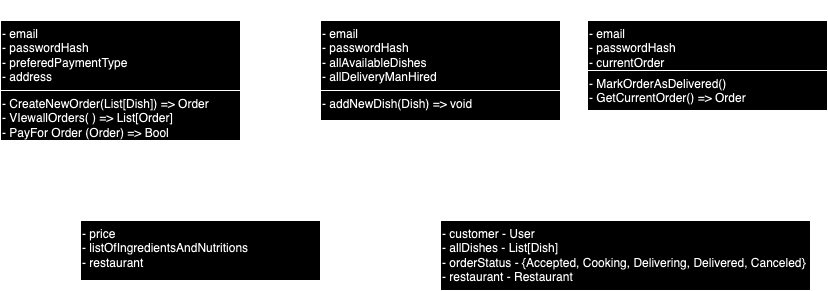

## Пользователи 
### User - покупатель
#### Поля
- email
- passwordHash
- preferedpaymentType
- address
#### Методы
- CreateOrder (List[Dish]) => Order
- ViewAllOrders() => List[Order]
- PayForOrder(Order) => Bool - result

### Restaurant - ресторан
#### Поля
- email
- passwordHash
- allAvailableDishes - List[Dish]
- allDeliveryManHired - List[Delivery]
#### Методы
- addNewDish (Dish)
### Delivery - доставщик
#### Поля
- email
- passwordHash
- currentOrder
#### Методы
- MarkOrderAsDelivered()
- GetCurrentOrder() => Order

## Dish
- price
- listOfIngredientsAndNutritions
- restaurant - Restaurant

## Order
- customer - User
- allDishes - List[Dish]
- orderStatus - {Accepted, Cooking, Delivering, Delivered, Canceled}
- restaurant - Restaurant

